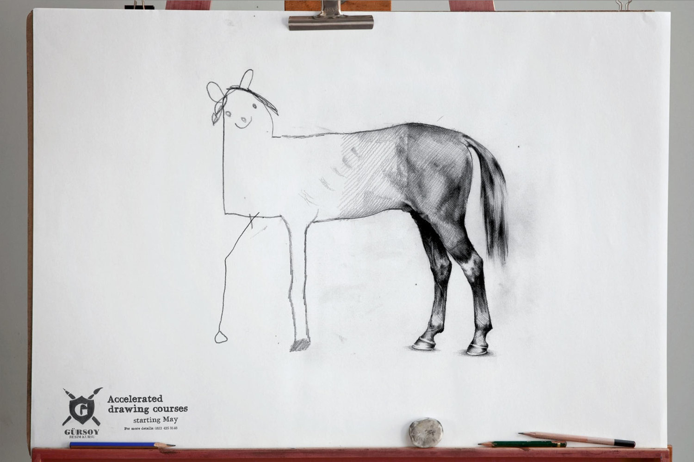

Roughly speaking, this project is a blend of machine learning, microelectronics, and control theory.

Our objective is to investigate the potential applicability and efficacy of Spiking Nerual Networks (SNNs) in the domain of robotic. The intention of this exploration is to discern the possible enhancements these types of nerual networks might introduce into the sphere of robotics, particularly in relation to control mechanisms.

## Project Status

